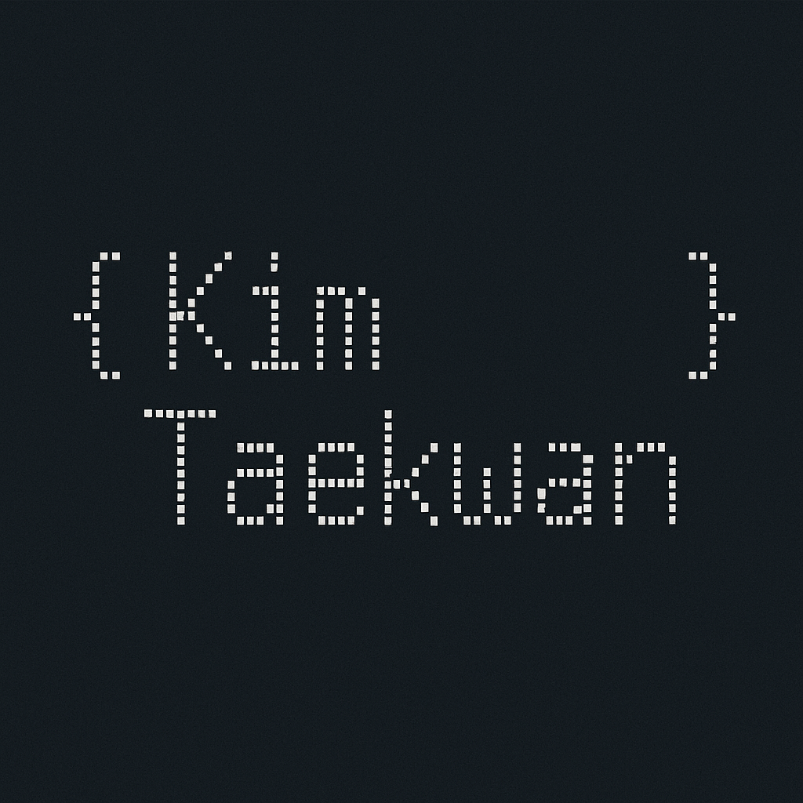

  

<h1 align="center">🧑🏻‍💻 TaeKwan Kim | Coding🧩 & Traveler🧳</h1>
<h3 align="center"><i>"U1대학교 AI소프트웨어학과 김태관"</i></h3>

  <!-- Animated typing SVG -->
  

  
  
  

---

## 💖 About Me

U1대학교를 졸업한 19학번 AI소프트웨어학과 김태관입니다.  
여기에 제가 공부하고있는 모든 내용과 결과물들을 업로드 할 생각입니다.

- 나이: 2000년생
- 좋아하는 음식: ☕️커피
- 취미: 🏋🏻‍♂️헬스  
- 특징: 커피없으면 코딩 못함

## 🛠️ Tech Stack (Reorganized)

<h3 align="center">🎨 Frontend</h3>

  
  
  
  
  

 

<h3 align="center">⚙️ Backend & APIs</h3>

  
  
  
  

 

<h3 align="center">🧠 Data / AI</h3>

  
  

 

<h3 align="center">🗄 Databases</h3>

  

 

<h3 align="center">🎨 Design & Creative</h3>

  
  
  
  

---

## 🔥 Activity Graph (Animated)

---

## 🐍 Contribution Snake

---

## 🔗 Featured Projects

  
  &nbsp;&nbsp; 

## 📬 Contact
📧 **Email**: xorhks4552@naver.com

> **천천히 꾸준히, 어제보다 더 발전한 오늘을 위해.**

---

  

© 2026 **TaeKwan Kim** | Powered by Whisper, GPT, and lifelong curiosity.
